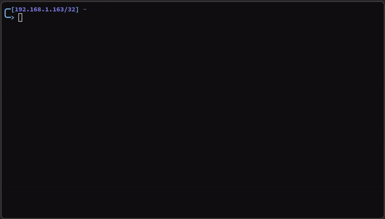

# pocket-femtanyl

transparent Hyprland layer shell overlay using bbpanzu's femtanyl token art.

(Hyprland v0.55+)

i try to match the 24fps, the perlin camera motion, the drop shadow, and the chromatic aberration.



## usage/installation

- build and install the rust program
- require the pocket-femtanyl.lua script in your hyprland config
  so that you can make token bop

```sh
./install.sh
```

## footguns

- If you have a weird non-systemd setup, make sure you started your display manager with `dbus-run-session`.
  I forgot to do that when testing.

## attribution

source code is gplv3

original femtanyl assets made by bbpanzu

https://files.catbox.moe/qyai7s.zip

i am not affiliated with femtanyl or bbpanzu
